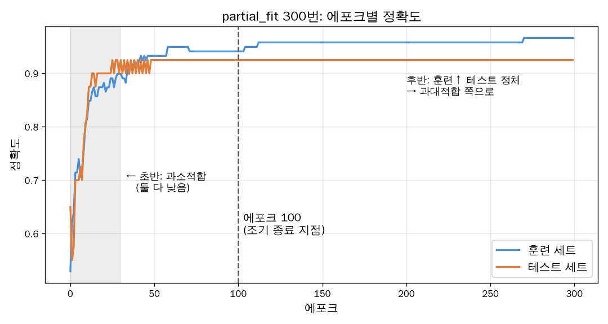

# 📘 4장 다양한 분류 알고리즘

## 04-1 로지스틱 회귀

### 럭키백의 확률 — 문제 설정

수산시장의 "럭키백"(어떤 생선이 들었는지 모르는 꾸러미)을 팔면서, 손님에게
**"이 생선이 도미일 확률 ○%, 농어일 확률 ○%"처럼 종류별 확률**을 알려주고 싶음.
→ 정답 하나만 내는 분류가 아니라, **클래스별 확률**을 내는 모델이 필요함.

> [!question] 추가 질문
> [[extra/ch04-럭키백-전제|복불복이면 확률은 재고 비율로 고정 아닌가? — 책이 빠뜨린 전제]]

### 데이터 준비

```python
fish = pd.read_csv('https://bit.ly/fish_csv_data')
fish_input = fish[['Weight', 'Length', 'Diagonal', 'Height', 'Width']]   # 특성 5개
fish_target = fish['Species']                                          # 정답 (7종)
```

| 문법 | 결과 |
|---|---|
| `fish['Species']` | 문자열 하나 → 컬럼 1개, `Series`(1차원) |
| `fish[['Weight', 'Length', ...]]` | 리스트 → 컬럼 여러 개를 적은 순서대로, `DataFrame`(표) |

이후 `train_test_split`으로 나누고, `StandardScaler`로 표준화 (`fit`은 train만, `transform`은 둘 다).
특성 5개의 스케일이 다르기 때문.

### k-최근접 이웃 분류기의 확률 예측

```
kn.score(...)          → 정확도(맞힌 비율)만. 확률 아님
kn.classes_            → fit 때 파악한 클래스 목록 (알파벳순). predict_proba의 열 순서와 같음
kn.predict(X)          → 클래스 이름 하나 (= predict_proba에서 확률이 가장 높은 것)
kn.predict_proba(X)    → 클래스별 확률 (행=샘플, 열=classes_ 순서)
```

> [!info] `_`로 끝나는 속성
> `classes_`, `coef_`, `intercept_`처럼 이름이 `_`로 끝나는 속성은 **`fit()` 후에 데이터에서 파악한 값**이다.
> `fit()` 전에는 존재하지 않음. 그리고 `fit()` 자체는 분류를 하지 않음 — 분류는 `predict()`에서 일어남.

> [!question] 추가 질문
> [[extra/ch04-predict_proba-이름표|predict_proba 결과 열에 클래스 이름을 붙이려면?]]

**k-NN 확률의 원리**: 가까운 이웃 k개 중 각 클래스의 **비율**을 확률로 씀.

```
k=3, 이웃 3마리 = [Perch, Perch, Roach]
→ Perch 2/3 = 0.6667, Roach 1/3 = 0.3333
```

`kneighbors()`로 실제 이웃을 확인해서 이 비율을 검증할 수 있음:

```python
distances, indexes = kn.kneighbors(test_scaled[3:4])   # [3:4]: 샘플 1개지만 2차원 유지
print(train_target.iloc[indexes[0]])                   # 이웃 3마리의 실제 종류
```

> [!question] 추가 질문
> - [[extra/ch04-슬라이싱과-차원|왜 [3:4]는 2차원이고, indexes도 2차원인가]]
> - [[extra/ch04-iloc-인덱싱|.iloc은 왜 쓰나 (초판/개정판 차이)]]

> [!warning] k-NN 확률의 한계
> k=3이면 나올 수 있는 확률이 `0, 1/3, 2/3, 1` **네 가지뿐**. 너무 거칠고 계단식이다.
> → 0~1 사이 어떤 값이든 매끄럽게 내는 방법이 필요 → **로지스틱 회귀**

### 로지스틱 회귀 — z와 시그모이드

**1단계**: 선형 회귀처럼 특성의 선형 결합을 계산함.
```
z = a×무게 + b×길이 + c×대각선 + d×높이 + e×두께 + f
```
`z`는 어떤 실수든 될 수 있음 (범위 제한 없음) → 그대로는 확률로 못 씀.

**2단계**: 시그모이드 함수로 0~1 사이로 압축함.
```
σ(z) = 1 / (1 + e^(-z))

z → +∞ 이면 σ → 1 에 가까워짐 (닿지는 않음)
z = 0  이면 σ = 0.5
z → -∞ 이면 σ → 0 에 가까워짐 (닿지는 않음)
```

> [!tip] 왜 항상 0~1 사이인가
> `e^(-z)`는 z가 무엇이든 **항상 양수**(지수함수의 성질) → `1 + e^(-z) > 1` →
> `1 / (1보다 큰 수)`는 항상 0과 1 사이. 그래프로 보고 짐작하는 게 아니라 증명 가능한 사실이다.

> [!question] 추가 질문
> [[extra/ch04-시그모이드-확률|시그모이드로 변환해도 확률의 성질이 보존되는가]]

### 로지스틱 회귀로 이진 분류 수행하기

먼저 7종 중 **도미(Bream)와 빙어(Smelt) 2종만** 골라서 이진 분류(답이 2개 중 하나인 문제)부터 함.
시그모이드 하나로 설명이 끝나는 가장 단순한 경우라서 먼저 보여주는 것.

#### 불리언 인덱싱 — True/False 체로 거르기

```
char_arr :   'A'    'B'    'C'    'D'    'E'
              ↕      ↕      ↕      ↕      ↕
체(mask) :  True  False  True  False  False
              ↓             ↓
결과     :  'A'           'C'          → ['A', 'C']
```

같은 위치끼리 짝지어 **True 자리만 남김**. 길이가 같아야 함.
책 코드는 이 체를 손으로 쓰지 않고 **조건으로 자동 생성**하는 것:

```python
bream_smelt_indexes = (train_target == 'Bream') | (train_target == 'Smelt')
train_bream_smelt = train_scaled[bream_smelt_indexes]     # 특성(문제지)
target_bream_smelt = train_target[bream_smelt_indexes]    # 정답(답안지)
```

```
train_target    :  'Bream'  'Perch'  'Smelt'  'Pike'  'Bream'
① == 'Bream'    :   True     False    False    False   True
② == 'Smelt'    :   False    False    True     False   False
① | ②           :   True     False    True     False   True    ← 자리마다 OR
```

> [!tip] 같은 체를 두 번 쓰는 이유
> 특성과 정답을 **같은 체**로 걸러야 행 순서가 그대로 짝이 맞는다.

> [!question] 추가 질문
> [[extra/ch04-불리언-인덱싱|왜 or가 아니라 |인가, 괄호는 왜 필요한가, 가운데 뚫린 문자는 뭔가]]

#### 훈련과 예측

```python
lr = LogisticRegression()
lr.fit(train_bream_smelt, target_bream_smelt)
lr.predict(train_bream_smelt[:5])         # ['Bream' 'Smelt' 'Bream' 'Bream' 'Bream']
lr.predict_proba(train_bream_smelt[:5])   # [[0.9976 0.0024] [0.0274 0.9726] ...]
```

**`fit()`이 하는 일 = 가중치 찾기**

```
w = 0 에서 출발 (모든 p = 0.5, "모르겠다")
  ↓
z = w·x + b → 시그모이드 → p → 오차 = p − 정답
  ↓
w ← w − 평균(오차 × 특성값)      ← 특성마다 따로, 같은 오차를 공유
  ↓
벌점(로그 손실)이 더 안 줄 때까지 반복 (도미/빙어는 11번)
```

목표는 "정답과 똑같이 맞히기"가 아니라 **정답 쪽 확률을 1에 가깝게** 만드는 것 (벌점 최소화).

> [!question] 추가 질문
> [[extra/ch04-가중치-학습-원리|가중치는 어떻게, 왜 그 방향으로 고쳐지나 — 작은 예제로 단계별 계산]]

#### 속을 들여다보기

| 코드 | 결과 | 의미 |
|---|---|---|
| `predict_proba` | `[Bream 확률, Smelt 확률]` | 확률. 판정은 `predict`가 0.5 기준으로 함 |
| `lr.classes_` | `['Bream' 'Smelt']` | 알파벳순 = `predict_proba`의 **열 순서**. 두 번째가 양성 |
| `lr.coef_` | `[[-0.40 -0.58 -0.66 -1.01 -0.73]]` | 특성 5개의 가중치. shape `(1, 5)` |
| `lr.intercept_` | `[-2.16]` | 절편 |
| `decision_function` | `[-6.03  3.57 -5.27 -4.24 -6.06]` | 생선마다의 **z 값**. z>0이면 Smelt |
| `expit(z)` | `[0.0024 0.9726 ...]` | 시그모이드 적용 = `predict_proba`의 **두 번째 열** |

```
특성 5개 ─(coef_, intercept_)→ z ─(expit = 시그모이드)→ Smelt 확률 ─(0.5 기준)→ predict
                              decision_function        predict_proba[:, 1]
```

> [!tip] 가중치가 전부 음수인 이유
> 표준화 후 빙어는 모든 특성이 음수(평균보다 작음). 음수 × 음수 = 양수 → z가 커져서 빙어 쪽.
> "값이 작은 특성이 불리하다"가 아니라, 가중치의 **부호까지 학습**해서 "작다 = 빙어"라는 증거로 쓴다.

### 로지스틱 회귀로 다중 분류 수행하기

```python
lr = LogisticRegression(C=20, max_iter=1000)
lr.fit(train_scaled, train_target)          # 7종 전체
lr.score(train_scaled, train_target)        # 0.933
lr.score(test_scaled, test_target)          # 0.925
```

| 매개변수 | 의미 |
|---|---|
| `max_iter=1000` | 가중치 수정 반복의 **상한** (기본 100). 수렴하면 그 전에 멈춤 |
| `C=20` | 규제 강도. **C가 클수록 규제가 약함** (릿지 `alpha`와 반대). 기본 1 |

```
C = 1  : 훈련 0.807  테스트 0.850   ← 규제가 세서 과소적합
C = 20 : 훈련 0.933  테스트 0.925
```

> [!question] 추가 질문
> [[extra/ch04-max_iter-실험|max_iter=50으로 줄여도 점수가 같은데? (경고의 의미)]]

**종마다 z를 하나씩 → 소프트맥스**

```
coef_.shape = (7, 5)        ← (종 수, 특성 수): 가로줄 하나 = 한 종의 가중치 세트
intercept_.shape = (7,)

생선 x (5개 값) → 7개 줄과 각각 내적 → z 7개 → 소프트맥스 → 확률 7개 (합 1)
```

```
소프트맥스 예: z = [2, 1, 0]
e^z     = [7.39, 2.72, 1.00]    합 11.11      ← 항상 양수, 큰 z는 훨씬 커짐
÷ 합    = [0.665, 0.245, 0.090] 합 1
```

| | 이진 분류 | 다중 분류 |
|---|---|---|
| `coef_` | (1, 5) → z 1개 | (7, 5) → z 7개 |
| 확률 변환 | 시그모이드 (`expit`) | 소프트맥스 (`softmax`) |
| 결과 | 양성 확률 1개 (나머지는 1−p) | 클래스별 확률 (합 1) |

> [!info] 다중 분류를 하는 방법들
> OvO(2종씩 짝지어 투표), OvR(한 종 vs 나머지 각각 시그모이드)도 있지만,
> sklearn `LogisticRegression`의 기본은 **z 7개를 한꺼번에 학습하는 소프트맥스(다항) 방식**.

> [!question] 추가 질문
> [[extra/ch04-다중분류-행렬|다중 분류에서 가중치가 고쳐지는 과정 — 선형대수로 5단계 시각화]]

> [!tip] 04-1 한 줄 요약
> k-NN 확률은 거칠다 → z를 만들고 시그모이드(2종)/소프트맥스(여러 종)로 확률로 바꾼다
> → 정답 쪽 확률이 커지도록 (오차 × 특성값)만큼 가중치를 반복 수정한다.

## 04-2 확률적 경사 하강법

### 점진적 학습 — 왜 필요한가

> [!info] 문제 상황
> 새 생선 데이터가 **조금씩 계속** 들어온다. 매번 전체 데이터로 처음부터 다시 학습하면 데이터가 쌓일수록 너무 무거워짐.
> → **이미 학습한 가중치는 그대로 두고, 새 데이터로 조금씩 이어서 고치는** 방법이 필요 = 점진적 학습

04-1에서 본 "오차 × 특성값만큼 빼서 가중치 고치기"가 바로 경사 하강법이다.
**확률적** 경사 하강법(SGD)은 이것을 **샘플을 무작위로 하나씩 꺼내서** 반복하는 방법.

```
에포크 1:  샘플 순서를 섞음 → 37번 생선으로 조금 수정 → 5번 생선으로 조금 수정 → ... (전체 한 바퀴)
에포크 2:  다시 섞음        → 88번 → 14번 → ...
```

| 용어 | 뜻 |
|---|---|
| 에포크(epoch) | 훈련 세트를 **한 바퀴** 모두 사용한 것 |
| 확률적 경사 하강법 | 샘플 **1개씩** 무작위로 골라 경사를 따라 내려감 |
| 미니배치 경사 하강법 | 여러 개씩 묶어서 |
| 배치 경사 하강법 | 전체를 한 번에 (정확하지만 무거움) |

### 손실 함수

> [!info] 손실 함수 = 모델이 얼마나 엉터리인지 재는 값 (작을수록 좋음)
> 정확도는 "맞음/틀림"으로 띄엄띄엄 변해서 경사(기울기)를 구할 수 없다. 그래서 매끄럽게 변하는 손실 함수를 대신 줄인다.

- 이진 분류 → **로지스틱 손실**(이진 크로스엔트로피), 다중 분류 → **크로스엔트로피 손실** (`loss='log_loss'`)
- 회귀 → 평균 제곱 오차

```
정답 1:  손실 = −log(p)        p=0.9 → 0.11    p=0.1 → 2.30
정답 0:  손실 = −log(1 − p)     p=0.1 → 0.11    p=0.9 → 2.30
```

> [!question] 추가 질문
> [[extra/ch04-손실값과-기울기|손실은 음/양에 관계없이 틀린 크기만 보나? — 방향은 기울기가 담당]]

### SGDClassifier

```python
sc = SGDClassifier(loss='log_loss', max_iter=10, random_state=42)
sc.fit(train_scaled, train_target)        # 0.782 / 0.800 (책 0.773 / 0.775) + ConvergenceWarning
sc.partial_fit(train_scaled, train_target) # 이어서 1 에포크 → 0.798 / 0.825
```

| 메서드 | 동작 |
|---|---|
| `fit()` | 가중치를 **처음부터** 다시 → `max_iter`번 반복 |
| `partial_fit()` | **지금 가중치에서 이어서** 1 에포크만 |

> [!warning] 앞 단계 주의
> - 스케일러는 `fit(train)`만 하고 test는 `transform`만 (같은 자로 재야 함)
> - 정답은 `fish['Species']`(1차원). `fish[['Species']]`(2차원)이면 `DataConversionWarning`
> - `max_iter=10`의 `ConvergenceWarning`은 책에서도 뜨는 **의도된 경고** (덜 학습된 상태를 만들어 `partial_fit`을 보여주려고)

> [!question] 추가 질문
> - [[extra/ch04-sgd-매개변수|random_state, tol, partial_fit의 classes, np.unique는 각각 무슨 역할인가]]
> - [[extra/ch04-sgd-경고와-전처리|스케일러는 왜 train에만 fit하나 / 실습 중 나온 경고 2개]]

### 에포크와 과대/과소적합 — 조기 종료

새 모델에 `partial_fit`만 300번 반복하며 에포크마다 점수를 기록:

```python
sc = SGDClassifier(loss='log_loss', random_state=42)
classes = np.unique(train_target)          # 처음 partial_fit에는 전체 클래스 목록 필요
for _ in range(0, 300):
    sc.partial_fit(train_scaled, train_target, classes=classes)
    train_score.append(sc.score(train_scaled, train_target))
    test_score.append(sc.score(test_scaled, test_target))
```



```
에포크 적음  → 둘 다 낮음                    → 과소적합
에포크 적당  → 테스트 점수 최고              → ← 여기서 멈춤 = 조기 종료 (책: 100)
에포크 많음  → 훈련만 오르고 테스트 정체/하락 → 과대적합
```

```python
sc = SGDClassifier(loss='log_loss', max_iter=100, tol=None, random_state=42)
sc.fit(train_scaled, train_target)          # 0.958 / 0.925
```

`tol=None`: 자동 멈춤을 끄고 **정확히 100 에포크** 돌게 함 (기본 tol=0.001이면 39 에포크에서 멈춰 0.706 / 0.675).

### 힌지 손실

```python
sc = SGDClassifier(loss='hinge', max_iter=100, tol=None, random_state=42)   # 책: 0.950 / 0.925
```

`hinge`는 **서포트 벡터 머신**의 손실 함수이고 `SGDClassifier`의 **기본값**이다.

```
힌지 손실 = max(0, 1 − 정답 × z)       (정답을 +1 / −1로 둠)

z (정답 +1)   로지스틱    힌지
  +2.0         0.13       0      ← z ≥ 1이면 벌점 0
  +0.5         0.47       0.5
   0.0         0.69       1.0
  −2.0         2.13       3.0
```

| | 로지스틱 (`log_loss`) | 힌지 (`hinge`) |
|---|---|---|
| 맞힌 샘플 | 확신을 더 높이도록 계속 작은 벌점 | 여유 있게(z ≥ 1) 맞으면 벌점 0 |
| 확률 | `predict_proba` 가능 | 불가 |

> [!tip] 04-2 한 줄 요약
> SGD = 샘플을 섞어 하나씩 보며 손실의 경사를 따라 조금씩 내려가는 방법. `partial_fit`으로 이어서 학습할 수 있고,
> 에포크가 너무 적으면 과소적합·많으면 과대적합 → 그래프로 적당한 지점을 골라 멈춘다(조기 종료).
> 손실 함수(`log_loss`, `hinge`)만 바꾸면 다른 모델이 된다.

---
🔗 다음 노트: [[ch05]]
