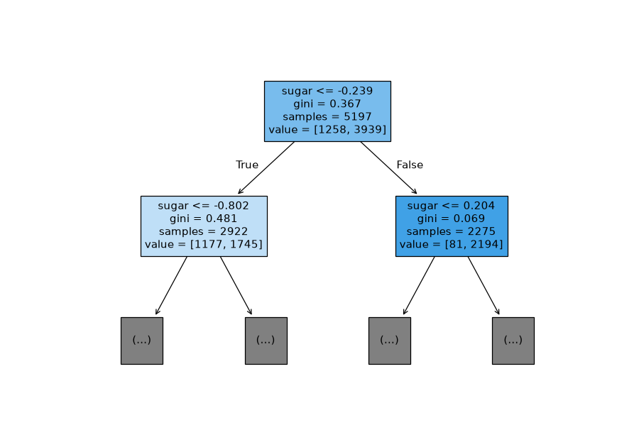
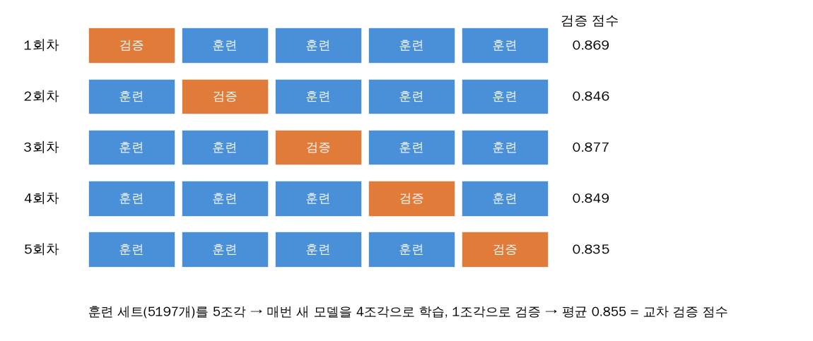

# 🌳 5장 트리 알고리즘

## 05-1 결정 트리

### 문제 — 와인을 레드/화이트로 분류

```python
wine = pd.read_csv('https://bit.ly/wine_csv_data')   # 6497병
data = wine[['alcohol', 'sugar', 'pH']]              # 특성 3개 → 2차원 (6497, 3)
target = wine['class']                               # 0 = 레드, 1 = 화이트 → 1차원 (6497,)
train_test_split(data, target, test_size=0.2, random_state=42)   # 개정판은 test 20%
```

| 확인 | 결과 |
|---|---|
| `wine.info()` | 모든 열 6497 non-null → 누락값 없음 |
| `wine.describe()` | 평균·표준편차·최소·최대 → 특성 스케일이 서로 다름 |

> [!warning] `class`를 특성에 넣지 말 것
> `wine[['alcohol', 'sugar', 'pH', 'class']]`처럼 정답을 특성에 넣으면 시험지에 답을 적어주는 것 → 의미 없는 100% 점수.

> [!question] 추가 질문
> [[extra/ch05-데이터-모양과-문법|특성은 왜 2차원, 정답은 왜 1차원? / 함수 vs 클래스 / 속성 vs 메서드]]

### 로지스틱 회귀로 먼저 시도 → 설명하기 어렵다

```
점수 0.781 / 0.778
coef_ = [0.51, 1.67, -0.69], intercept_ = 1.82
→ "당도 가중치 1.67이라서 화이트" … 사람에게 설명하기 어려움
```

### 결정 트리 — 예/아니오 질문을 이어가는 모델

```python
dt = DecisionTreeClassifier(random_state=42)
dt.fit(train_scaled, train_target)          # 0.997 / 0.859 → 과대적합
```



```
노드 칸 읽기
  sugar <= -0.239       ← 질문 (표준화 단위. 원래 단위로는 4.325)
  gini = 0.367          ← 불순도
  samples = 5197        ← 도착한 샘플 수
  value = [1258, 3939]  ← [레드, 화이트]
  왼쪽 화살표 = True(예), 오른쪽 = False(아니오) / filled=True: 화이트 많을수록 진한 파랑
```

| 용어 | 뜻 |
|---|---|
| 루트 노드 | 맨 위 첫 질문 |
| 리프 노드 | 맨 아래 끝 칸 → 더 많은 클래스로 최종 판정 |
| 깊이 | 질문 단계 수 |

| | 로지스틱 회귀 | 결정 트리 |
|---|---|---|
| 학습으로 구하는 것 | 가중치·절편 | **질문 목록** (어떤 특성을 어떤 기준값으로) |
| 학습 방법 | 경사를 따라 조금씩 수정 | 후보 질문을 전부 시도해 가장 깔끔하게 나누는 것 선택 |
| 예측 | 저장한 가중치로 z 계산 | 저장한 질문을 따라 내려감 |
| 여러 특성 사용 | 곱해서 **더함** (직선 경계) | 질문을 **이어서** 조건을 쌓음 (사각형 칸) |


> [!question] 추가 질문
> [[extra/ch05-트리-학습-원리|학습은 어떻게? 기준값은 연속인데 어떻게 다 시도? 질문 하나에 특성 하나면 여러 특성은? random_state는 왜?]]

### 불순도 — 질문을 고르는 기준

```
지니 불순도 = 1 − (레드 비율² + 화이트 비율²)
반반 0.5 (최악) / 9:1 → 0.18 / 순수 → 0
```


```
정보 이득 = 부모 불순도 − (자식 불순도들의 샘플 수 가중 평균)

부모 [1258 / 3939] 지니 0.367
  ├ 예   [1177 / 1745] 2922병 지니 0.481
  └ 아니오 [81 / 2194]   2275병 지니 0.069
자식 평균 = (2922×0.481 + 2275×0.069) / 5197 = 0.301 → 정보 이득 0.066 (모든 후보 중 최대)
```

`criterion='entropy'`로 엔트로피 불순도(−Σ p·log₂p)를 쓸 수도 있다.

### 가지치기

```python
dt = DecisionTreeClassifier(max_depth=3, random_state=42)   # 0.845 / 0.842 → 과대적합 해소
```

> [!info] 결정 트리는 표준화가 필요 없다
> 질문은 **특성 하나를 기준값과 비교**만 한다. 표준화해도 값의 순서가 그대로라 같은 와인이 같은 쪽으로 간다.
> 표준화 안 한 `train_input`으로 학습해도 점수가 똑같고(0.845 / 0.842), 기준값이 `sugar <= 4.325`처럼 읽기 쉬워진다.

> [!warning] 학습한 형태 그대로 평가하기
> 표준화 데이터로 `fit`하고 `score(train_input, ...)`(원래 값)으로 평가하면 0.758처럼 엉뚱하게 나온다.
> `plot_tree(feature_names=[...])` 순서도 학습 때 열 순서와 같아야 한다 (틀려도 에러가 안 남).
> → [[extra/ch05-실습-실수-모음|실습 중 실수 모음]]

### 특성 중요도

```python
dt.feature_importances_    # [0.123, 0.869, 0.008]  → alcohol, sugar, pH
```

각 특성이 만든 정보 이득의 합(전체 합 1). **당도가 87%** → 레드/화이트를 가르는 핵심 특성.

> [!tip] 05-1 한 줄 요약
> 결정 트리 = 정보 이득이 가장 큰 질문(특성·기준값)을 골라 데이터를 계속 나누는 모델.
> 설명하기 쉽고 표준화가 필요 없지만, 그냥 두면 과대적합 → 가지치기(`max_depth` 등)로 제한.

## 05-2 교차 검증과 그리드 서치

### 테스트 세트를 아껴야 하는 이유 → 검증 세트

`score()`는 모델을 바꾸지 않는다. 그러나 **테스트 점수를 보며 사람이 설정(max_depth 등)을 고르면** 그 선택이 테스트 세트에 맞춰진다 → 테스트 점수가 실제보다 낙관적.

```
훈련 세트 ─┬─ sub (60%)  → fit
           └─ val (20%)  → 설정 고르기
테스트 (20%)              → 맨 마지막에 한 번만
```

```python
sub_input, val_input, sub_target, val_target = train_test_split(
    train_input, train_target, test_size=0.2, random_state=42)    # (4157, 3) (1040, 3)
dt.fit(sub_input, sub_target)        # 0.997 / 검증 0.864
```

> [!question] 추가 질문
> [[extra/ch05-검증과-그리드서치|score만 해도 테스트 세트에 맞춰진다는 게 무슨 뜻? / cv는 하이퍼파라미터? / best_estimator_]]

### 교차 검증

검증 세트를 떼면 훈련 데이터가 줄고, 어떤 데이터가 검증으로 뽑혔는지에 따라 점수가 흔들린다 → 돌아가며 검증.



```python
scores = cross_validate(dt, train_input, train_target)   # 기본 5-폴드
# {'fit_time': [...], 'score_time': [...], 'test_score': [0.869 0.846 0.877 0.849 0.835]}
np.mean(scores['test_score'])                            # 0.855
```

- `'test_score'`는 이름과 달리 **검증 폴드 점수** (진짜 테스트 세트는 안 씀)
- `cross_validate`는 모델을 **복사**해서 학습 → 원본 `dt`는 안 바뀜

### 분할기

`cv=`에는 **숫자**(조각 수) 또는 **분할기 객체**(조각 수 + 섞기 + 비율 맞추기)를 넣는다.

```python
cross_validate(dt, ..., cv=StratifiedKFold())        # 0.8553 ← 분류 모델 기본값과 같음
splitter = StratifiedKFold(n_splits=10, shuffle=True, random_state=42)
cross_validate(dt, ..., cv=splitter)                 # 0.8574
```

| 분할기 | 특징 |
|---|---|
| `KFold` | 그냥 k조각 (회귀 기본) |
| `StratifiedKFold` | 조각마다 클래스 비율을 전체와 같게 (분류 기본) |

### 하이퍼파라미터와 그리드 서치

> [!info] 하이퍼파라미터 = 모델이 학습하지 못해 사람이 정하는 값
> 트리: `max_depth`, `min_impurity_decrease`, `min_samples_split`, `min_samples_leaf`, `max_leaf_nodes`, `criterion`, `max_features` …
> 서로 영향을 주므로 하나씩 고정해가며 고르면 안 되고 **조합**으로 찾아야 한다.

```python
params = {'min_impurity_decrease': [0.0001, 0.0002, 0.0003, 0.0004, 0.0005]}
gs = GridSearchCV(DecisionTreeClassifier(random_state=42), params, n_jobs=-1)
gs.fit(train_input, train_target)     # 5후보 × 5폴드 = 25번 + 최종 1번
gs.best_params_                       # {'min_impurity_decrease': 0.0001}
gs.cv_results_['mean_test_score']     # [0.868 0.865 0.865 0.868 0.868]
dt = gs.best_estimator_               # 최고 설정 + 전체 훈련 세트로 다시 학습한 모델
dt.score(train_input, train_target)   # 0.9615
```

```
gs.fit() 안에서
① 후보마다 교차 검증 → 평균 점수가 가장 높은 설정 선택
② 그 설정으로 훈련 세트 전체(5197개)에 다시 fit → best_estimator_   (refit, 자동)
```

여러 매개변수를 동시에 (모든 조합):

```python
params = {'min_impurity_decrease': np.arange(0.0001, 0.001, 0.0001),   # 9개
          'max_depth': range(5, 20, 1),                                 # 15개
          'min_samples_split': range(2, 100, 10)}                       # 10개
# 9 × 15 × 10 = 1350 조합 × 5폴드 = 6750번 학습
```

> [!warning] 오래 걸리는 게 정상
> 6750번 학습이라 컨테이너(4코어)에서 약 1분. `n_jobs=-1`(모든 코어 사용)이어도 수십 초~몇 분 걸린다. 중간에 멈추면 `KeyboardInterrupt`.
> 참고 결과: `{'max_depth': 14, 'min_impurity_decrease': 0.0004, 'min_samples_split': 12}`, 교차 검증 0.868, 테스트 0.862

> [!tip] 05-2 한 줄 요약 (그리드 서치까지)
> 테스트 세트는 마지막에 한 번만. 설정 고르기는 교차 검증 점수로 하고, 그리드 서치가 모든 조합을 교차 검증한 뒤
> 최고 설정으로 전체 훈련 세트에 다시 학습해준다(`best_estimator_`).
> 다음: 랜덤 서치 (`RandomizedSearchCV`, scipy `uniform`/`randint`)

---
🔗 다음 노트: [[ch06]]
