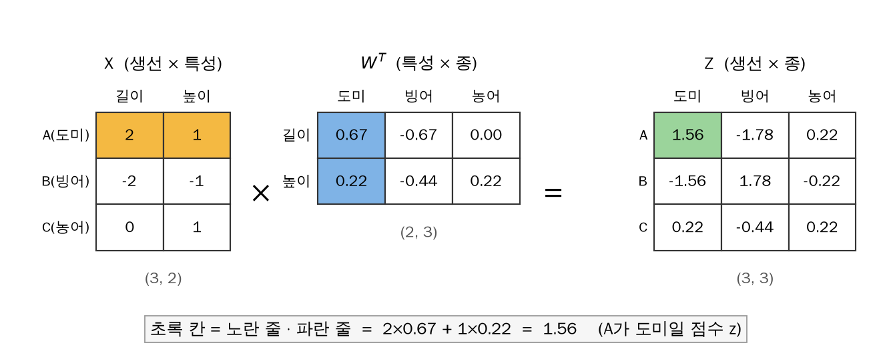
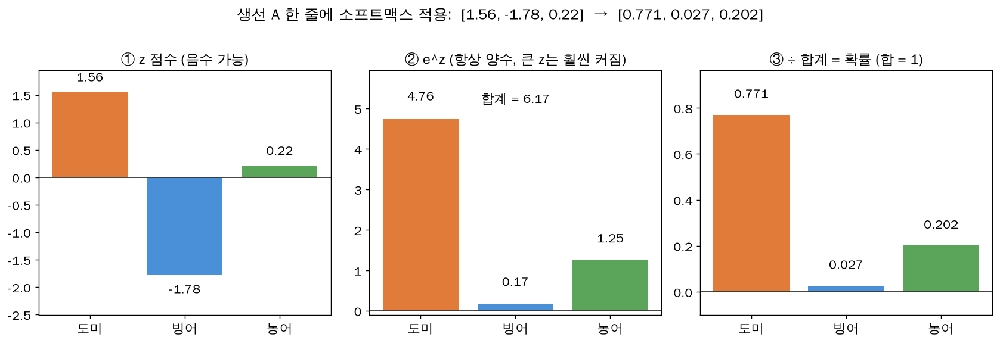
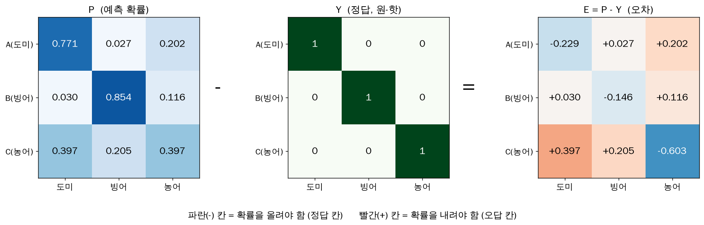
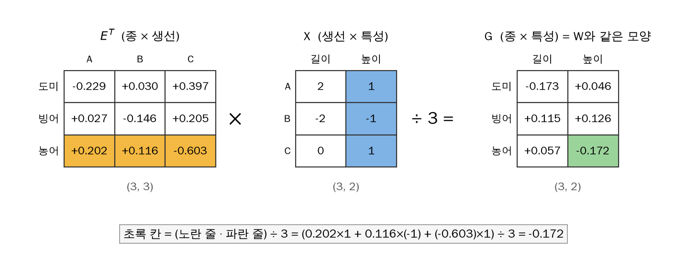
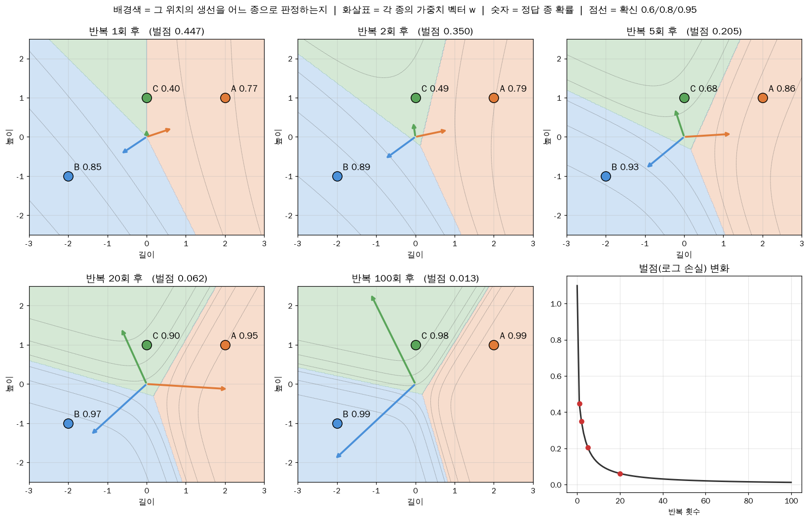

# 다중 분류에서 가중치가 고쳐지는 과정 — 행렬로 5단계

> [[ch04|← 4장 원리 노트로 돌아가기]]

**Q: 다중 분류에서 가중치 수정이 일어나는 과정을 선형대수로 시각적으로 보고 싶다.**

예제: 생선 3마리, 특성 2개(길이, 높이), 종 3개(도미, 빙어, 농어).

```
X = A(도미) [ 2,  1]      Y (원-핫 정답) = [1, 0, 0]
    B(빙어) [-2, -1]                       [0, 1, 0]
    C(농어) [ 0,  1]                       [0, 0, 1]
```

```
1. Z = X·Wᵀ + b      각 생선 × 각 종의 점수       (n,특성)×(특성,종) = (n,종)
2. P = softmax(Z)    줄마다 확률로 변환 (합 1)
3. E = P − Y         정답 칸 −, 오답 칸 +
4. G = Eᵀ·X / n      W와 같은 모양의 수정량        (종,n)×(n,특성) = (종,특성)
   W ← W − G
5. 반복 → 수렴
```

## 1단계: Z = X · Wᵀ + b



```
Z[A, 도미] = (A의 줄) · (도미 가중치 줄) = 2×0.67 + 1×0.22 = 1.56
```

- **모양 규칙**: `(3, 2) × (2, 3) = (3, 3)` — 안쪽 숫자(특성 수)가 맞물려 사라지고, 바깥 숫자가 결과 모양.
- 실제 데이터: `(119, 5) × (5, 7) = (119, 7)`. `coef_`는 (종, 특성) = (7, 5)이고 이를 눕힌 것이 Wᵀ.

## 2단계: P = softmax(Z)



```
Z (3,3)                          P (3,3)                      줄 합
A [ 1.56  -1.78   0.22]   →    [0.771  0.027  0.202]           1
B [-1.56   1.78  -0.22]   →    [0.030  0.854  0.116]           1
C [ 0.22  -0.44   0.22]   →    [0.397  0.205  0.397]           1    ← 도미/농어 동점, 헷갈림
```

- `e^z`: 음수도 양수로, 차이는 더 벌어지게
- `÷ 합`: 줄마다 합이 1

## 3단계: E = P − Y



| 칸 | 부호 | 의미 |
|---|---|---|
| 정답 칸 (대각선) | 항상 − | 확률을 **올려야** 함 |
| 오답 칸 | 항상 + | 확률을 **내려야** 함 |

각 줄의 합은 항상 0 (한 칸을 올리면 다른 칸이 내려가는 구조). 이진 분류의 `오차 = p − 정답`을 종 여러 개로 넓힌 것.

## 4단계: G = Eᵀ · X / n, W ← W − G



```
G[종 k, 특성 j] = 평균( 종 k의 오차 × 특성 j )      ← 이진 분류 규칙을 종마다 적용
```

E를 눕혀야(Eᵀ) 종이 가로줄로 와서 X와 곱할 수 있음. **생선 수가 맞물려 사라짐 = 생선들에 대해 더한다**는 뜻.

```
G[농어, 높이] = (0.202×1 + 0.116×(−1) + (−0.603)×1) ÷ 3 = −0.172
W[농어, 높이] = 0.22 − (−0.172) = 0.39       ← C를 농어로 맞히도록 커짐
```

```
            W (전)              G               W (후)
도미  [ 0.67   0.22]  − [−0.173 +0.046]  = [ 0.84   0.18]
빙어  [−0.67  −0.44]  − [+0.115 +0.126]  = [−0.78  −0.57]
농어  [ 0.00   0.22]  − [+0.057 −0.172]  = [−0.06   0.39]
```

- 1단계의 W도 W = 0(모든 확률 1/3)에서 같은 계산 1번으로 나온 값이다.
- 절편: `b ← b − (E의 세로줄 평균)` (특성값 대신 1을 곱한 것).

## 5단계: 반복



- **화살표** = W의 각 줄(종별 가중치 벡터). `z_종 = w_종 · x`는 내적이므로, 생선이 그 화살표 방향에 가까울수록 z가 큼.
- 반복할수록 화살표가 정답 생선 쪽으로 **회전하고 길어짐** → 길수록 z 차이가 커져 확률이 1에 가까워짐.
- **배경색** = z가 가장 큰 종(판정 영역). 반복 1회에는 C가 경계선 위(0.40) → 5회 0.68 → 20회 0.90.
- **벌점**은 처음엔 빠르게, 이후 완만하게 감소 (E가 작아지면 G도 작아짐) → 수렴.

> [!warning] 규제
> 이 예제는 생선이 3마리라 화살표가 끝없이 길어질 수 있다. 실제 `LogisticRegression`은
> **규제(C)** 가 이를 막는다. `C=20`은 그 브레이크를 약하게 건 것.

> [!tip] 이진 분류와의 관계
> 이진 분류 = 이 구조에서 줄이 1개(z 1개)이고 softmax 대신 sigmoid를 쓰는 특수한 경우.
