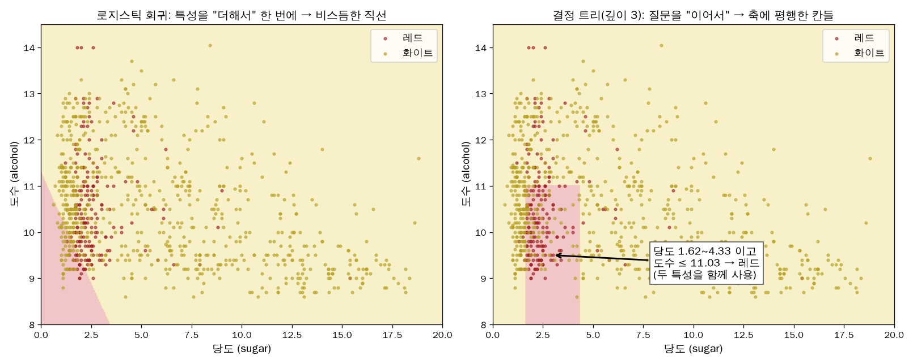
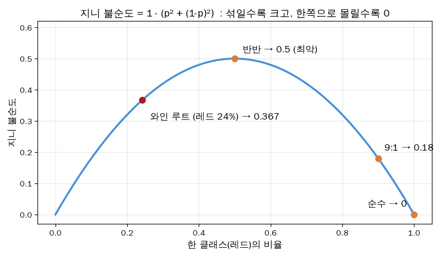

# 결정 트리는 어떻게 학습하나

> [[ch05|← 5장 원리 노트로 돌아가기]]

## 1. 학습(fit) vs 예측(predict)

```
fit()     : 훈련 데이터로 "어떤 특성을, 어떤 기준값으로 물을지" 정해 나무를 만듦   ← 학습
predict() : 저장된 질문만 따라 내려감. 훈련 데이터는 다시 안 봄                 ← 추론
```

**작은 예: 와인 6병, 특성 1개**

```
당도 :  1.0   1.5   2.0   3.0   5.0   8.0
정답 :  레드  레드  레드  화이트 화이트 화이트

후보 "당도 ≤ ?"    예 쪽            아니오 쪽         정보 이득
   ≤ 1.25        레드1            레드2 화이트3
   ≤ 1.75        레드2            레드1 화이트3
   ≤ 2.5         레드3            화이트3           0.5   ✅ 최대 → 선택
   ≤ 4.0         레드3 화이트1    화이트2           0.25
   ≤ 6.5         레드3 화이트2    화이트1

새 와인 당도 4.0 → "≤ 2.5?" 아니오 → 화이트
```

## 2. 기준값은 연속인데 어떻게 다 시도하나

**데이터 사이의 틈마다 하나씩**만 시도하면 된다. 이웃한 두 값 사이 어디에 기준을 두든 나뉘는 결과가 같기 때문.

```
정렬된 고유값 :  1.0    2.0    3.0    5.0
후보 기준값   :     1.5    2.5    4.0         ← (고유값 수 − 1)개, 중간값
```

- 와인 훈련 세트: alcohol 104, sugar 304, pH 107개 고유값 → 루트에서 후보 512개
- 책의 `sugar <= 4.325` = 훈련 세트에서 이웃한 4.3과 4.35의 **중간값**
- 빠른 계산: 값을 한 번 정렬 → 기준선을 한 칸씩 옮기며 개수만 ±1 갱신 → 지니 계산

## 3. 질문 하나 = 특성 하나인데 여러 특성은?

질문을 **이어서** 하므로 경로 하나가 특성들의 조합이 된다 (깊이 3 실제 트리).

```
당도 > 1.62  그리고  당도 ≤ 4.33  그리고  도수 ≤ 11.03   →  레드 (798 / 343)
```

앞 질문의 답에 따라 다음에 볼 특성이 달라짐 → 특성 간 관계(상호작용)가 자동으로 반영됨.
로지스틱 회귀는 특성을 **더해서** 직선 하나, 트리는 질문을 **이어서** 축에 평행한 칸들
(특성 2개 예시 테스트 정확도: 로지스틱 0.721 / 트리 0.842).



## 4. random_state는 왜 필요한가

> [!warning] "특성을 무작위로 골라 질문한다"가 아님
> 매 노드에서 특성 순서를 **섞은 뒤** 모든 특성 × 모든 기준값을 전부 시도해서 최고를 고른다.
> 랜덤이 영향을 주는 건 **정보 이득이 동점**일 때 누가 먼저 검사됐느냐뿐.

```
random_state   제한 없음(테스트)   max_depth=3(테스트)
    42            0.8585              0.8415
     2            0.8592              0.8415
     7            0.8562              0.8415     ← 깊이 3은 항상 같음 (위쪽 질문은 확실한 1등)
```

특성을 일부만 무작위로 뽑는 방식은 5-3 랜덤 포레스트에서 나온다.

## 5. 지니 불순도 계산

```
지니 = 1 − Σ (클래스 비율)²

[50 / 50]  → 1 − (0.25 + 0.25) = 0.5
[90 / 10]  → 1 − (0.81 + 0.01) = 0.18
[100 / 0]  → 1 − 1             = 0
```



정보 이득 = 부모 지니 − 자식 지니의 (샘플 수) 가중 평균. 루트: 0.367 − 0.301 = **0.066**.
